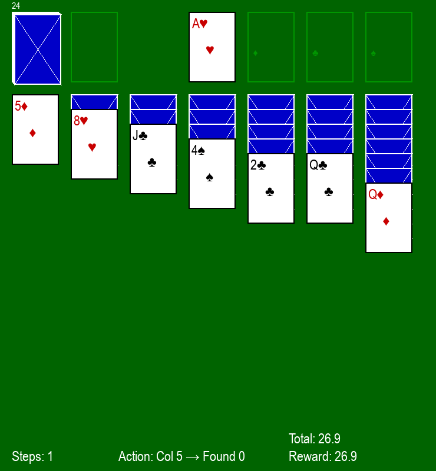

# Play With AI Games

Zbiór prostych projektów i eksperymentów związanych z zastosowaniem algorytmów uczenia maszynowego w grach.

W repo znajdziesz m.in. implementację agenta RL dla gry Snake wraz z narzędziami do treningu, testów i wizualizacji wyników.

## Projekty

### 🐍 Snake — RecurrentPPO Agent

Agent RL trenowany do gry w Snake na siatkach o zmiennych rozmiarach.

| Demo |
|:---:|
|  |

- [Więcej informacji](snake/README.md)
- Trening, testowanie, analiza modelu, generowanie GIF

### 🃏 Solitaire — MaskablePPO Agent

Agent RL dla gry Pasjans Klondike z obsługą niewalidnych akcji (masked actions).

| Demo |
|:---:|
|  |

- [Więcej informacji](solitaire/README.md)
- Trening, testowanie w Pygame, nagrywanie GIF

Każdy projekt zawiera własne instrukcje uruchomieniowe i opis konfiguracji.

## Wymagania

- Python 3.10+
- pip
- (opcjonalnie) środowisko wirtualne, np. `venv`

## Szybka instalacja

Przykład (Windows PowerShell):

```powershell
python -m venv venv
.\venv\Scripts\Activate.ps1
pip install -r requirements.txt
# Jeśli potrzebujesz konkretnej wersji torch (dostosuj do swojej konfiguracji GPU/CPU):
pip uninstall torch
pip install torch>=2.7 --index-url https://download.pytorch.org/whl/cu128
```

Szczegóły dotyczące uruchamiania i konfiguracji znajdziesz w README odpowiedniego podprojektu.