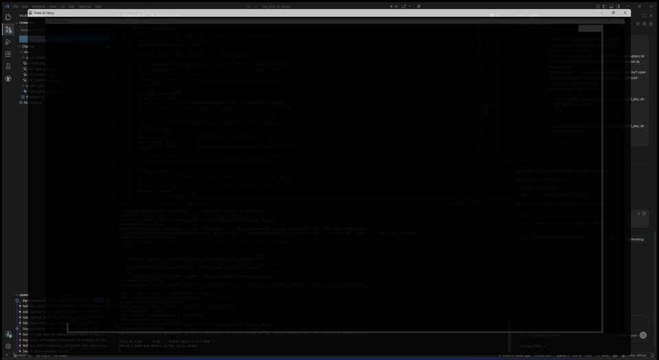

# Play With AI Games

Zbiór projektów i eksperymentów z uczeniem maszynowym w grach. Każdy podprojekt ma własne środowisko, skrypty treningowe oraz opis uruchomienia.

## Projekty

### Chess — CNN + Gumbel MCTS

Silnik szachowy uczony w dwóch etapach: najpierw z partii mistrzowskich (IL), następnie przez self-play z MCTS (RL). Projekt zawiera pygame GUI, adapter UCI, ewaluację Elo przeciw Stockfishowi oraz wykresy jakości i wydajności treningu.

| Demo: AI vs AI |
|:---:|
|  |

- [Dokumentacja, uruchamianie i statystyki treningów](chess/README.md)

### Snake — PPO Agent

Agent RL trenowany do gry w Snake na siatkach o różnych rozmiarach.

| Demo |
|:---:|
|  |

- [Więcej informacji](snake/README.md)
- Trening, testowanie, analiza modelu i generowanie GIF-ów

### Solitaire — MaskablePPO Agent

Agent RL dla pasjansa Klondike z obsługą niedozwolonych akcji przez action masking.

| Demo |
|:---:|
|  |

- [Więcej informacji](solitaire/README.md)
- Trening, testowanie w Pygame i nagrywanie GIF-ów

## Instalacja

Przykład dla Windows PowerShell:

```powershell
py -3.13 -m venv venv
.\venv\Scripts\Activate.ps1
python -m pip install --upgrade pip
pip install -r requirements.txt
```

Szczegóły zależności i konfiguracji znajdują się w README odpowiedniego podprojektu.
