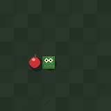
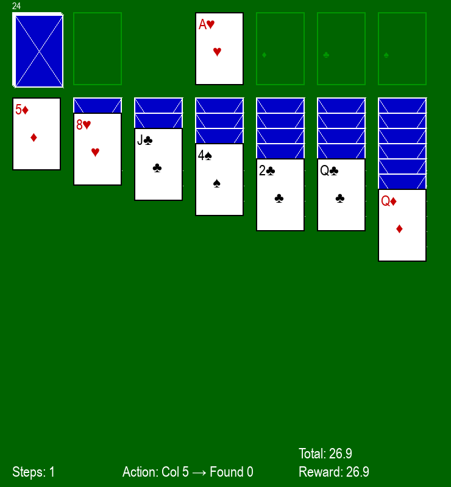

# Play With AI Games

Zbiór prostych projektów i eksperymentów związanych z zastosowaniem algorytmów uczenia maszynowego w grach.

W repo znajdziesz m.in. implementację agenta RL dla gry Snake wraz z narzędziami do treningu, testów i wizualizacji wyników.

## Projekty

### 🐍 Snake — PPO Agent

Agent RL trenowany do gry w Snake na siatkach o zmiennych rozmiarach.

| Demo |
|:---:|
|  |

- [Więcej informacji](snake/README.md)
- Trening, testowanie, analiza modelu, generowanie GIF

### 🃏 Solitaire — MaskablePPO Agent

Agent RL dla gry Pasjans Klondike z obsługą niewalidnych akcji (masked actions).

| Demo |
|:---:|
|  |

- [Więcej informacji](solitaire/README.md)
- Trening, testowanie w Pygame, nagrywanie GIF

Każdy projekt zawiera własne instrukcje uruchomieniowe i opis konfiguracji.

## Wymagania

- Python 3.13
- pip
- środowisko wirtualne, np. `venv`

## Szybka instalacja

Przykład (Windows PowerShell):

```powershell
python -m venv venv    /    py -3.13 -m venv venv
venv\Scripts\activate
python -m pip install --upgrade pip
pip install -r requirements.txt
```

Szczegóły dotyczące uruchamiania i konfiguracji znajdziesz w README odpowiedniego podprojektu.