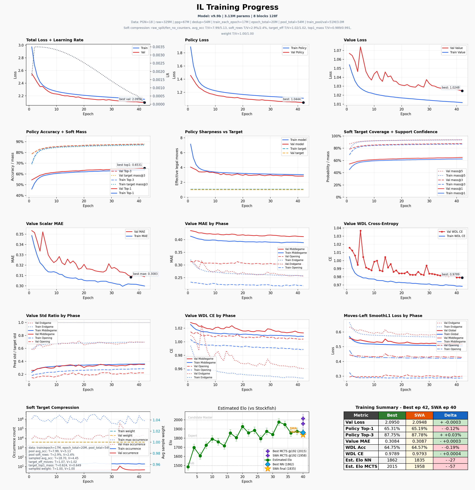
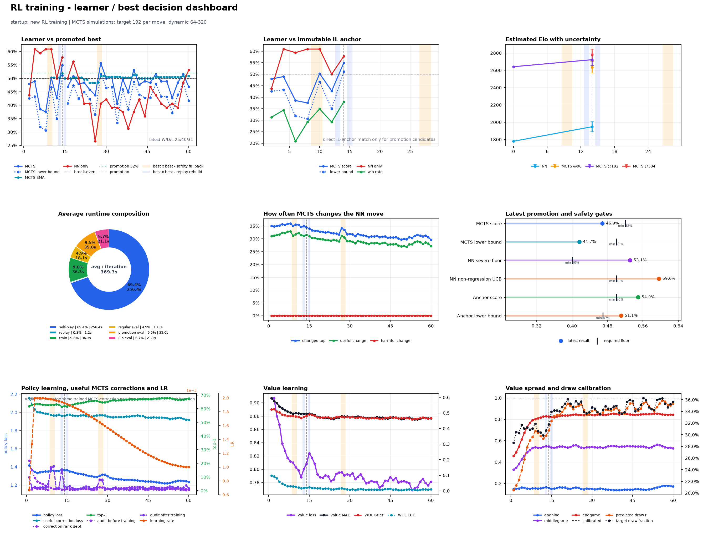
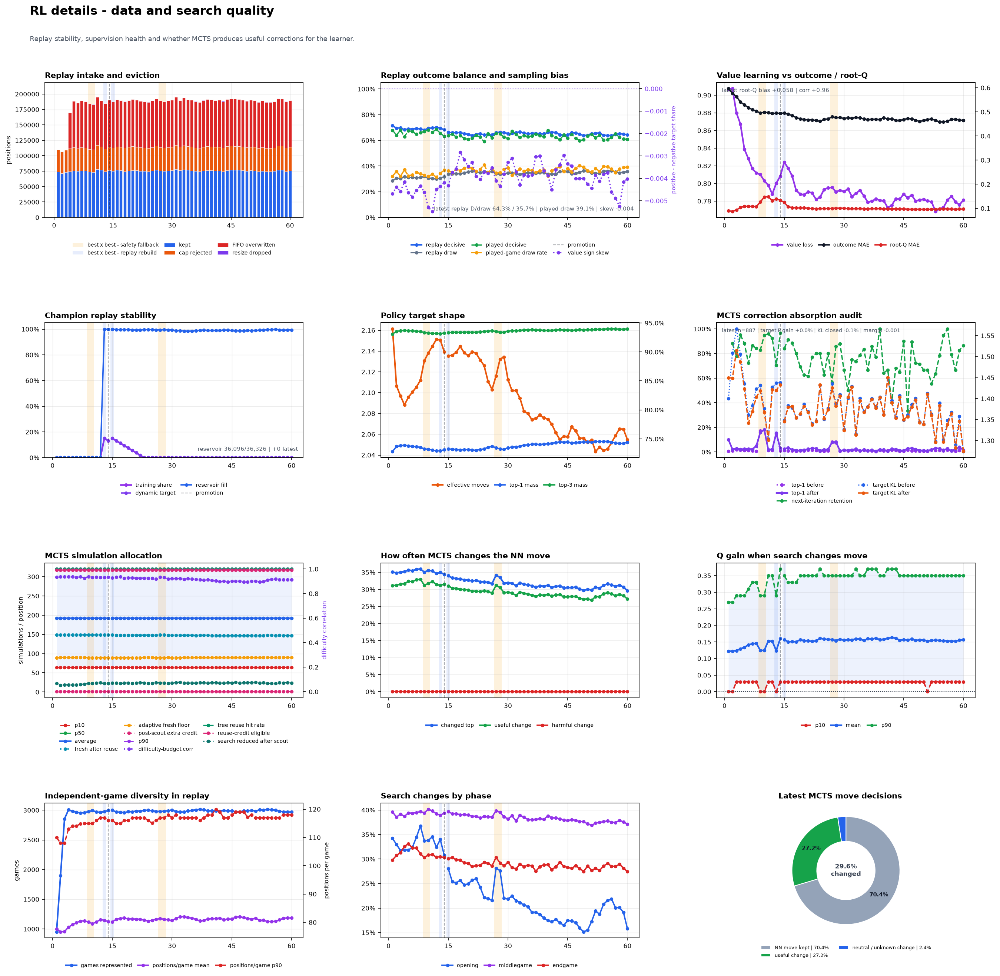
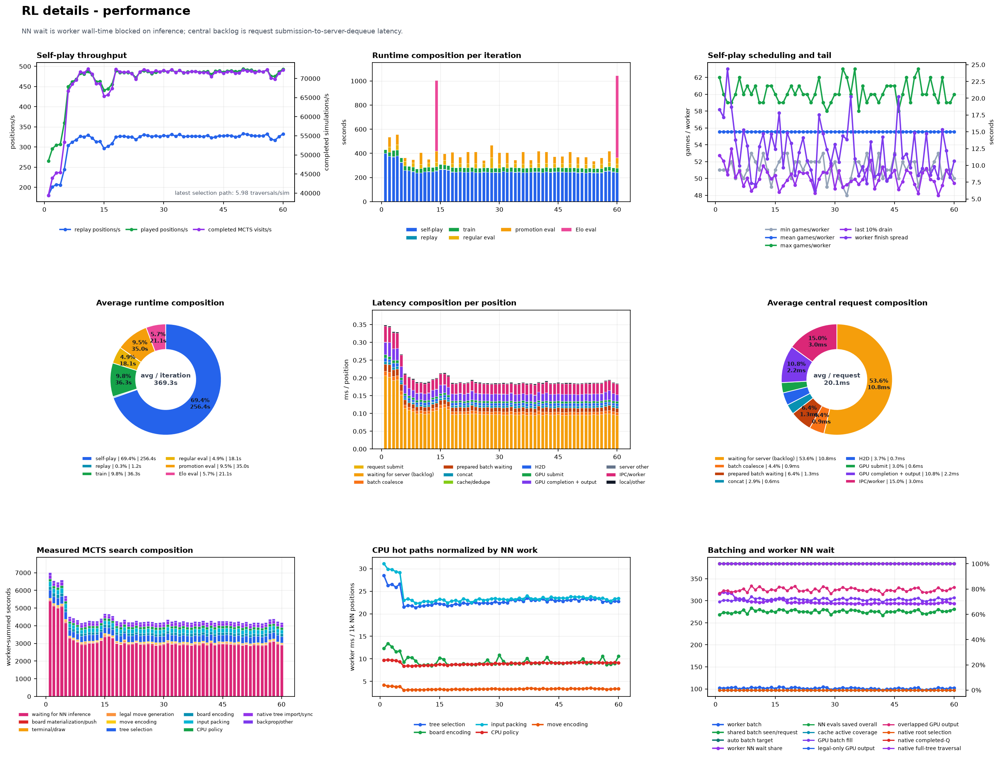

# Chess AI — CNN, Gumbel MCTS i self-play

Silnik szachowy inspirowany AlphaZero. Model uczy się najpierw z partii mistrzowskich (**Imitation Learning, IL**), a później poprawia przez **Reinforcement Learning, RL**: self-play, Gumbel MCTS, replay i kontrolowaną promocję najlepszego checkpointu.

Projekt zawiera gotowe GUI Pygame, adapter UCI, narzędzia do treningu i ewaluacji Elo oraz trzy osobne dashboardy RL: wynik/promotion, jakość danych i wydajność.

## Szybki start

Po instalacji zależności zgodnie z [głównym README](../README.md), komendy uruchamiaj z głównego katalogu repozytorium.

```powershell
# Pobranie partii PGN do chess/data/
python .\chess\scripts\download_nikonoel_pgns.py

# Trening nadzorowany z PGN
python .\chess\scripts\train_il.py

# Syzygy WDL dla końcówek 3–5 bierek używane przez self-play RL
python .\chess\scripts\download_syzygy.py --preset wdl_345

# Self-play i trening RL od checkpointu IL
python .\chess\scripts\train_rl.py
```

## Gra w GUI

```powershell
# Otwiera konfigurator Play
python .\chess\scripts\play.py
```

Konfigurator Play pozwala wybrać Human vs AI, AI vs AI lub Human vs Human, kolory i checkpointy. Dla każdej strony AI ustawia się tam użycie MCTS oraz jego budżet, więc nie trzeba zmieniać tego ręcznie flagą CLI.

W trybie AI vs AI można ustawić liczbę partii — użyj większego meczu zamiast pojedynczej gry, gdy chcesz obiektywnie porównać dwa checkpointy. W czasie gry `Spacja` pauzuje/wznawia AI vs AI, `R` rozpoczyna nową partię, a `U` cofa ruch. Partie są zapisywane jako PGN w `chess/games/`.

### Nagranie demo AI vs AI

```powershell
python .\chess\scripts\utils\record_play_demo.py
```

Skrypt uruchamia `play.py` i nagrywa całe okno. W konfiguracji wybierz **AI vs AI**, modele i **Start Game**; po wyjściu z Play zapisze GIF jako `chess/docs/play-ai-vs-ai.gif`. Domyślnie nagrywa w 6 FPS i maksymalnej szerokości 960 px; dla lepszej jakości użyj `--fps 10 --max-width 1280`.

Pozostałe wejścia:

```powershell
python .\chess\scripts\eval_elo.py       # ocena checkpointów vs Stockfish
python .\chess\scripts\list_models.py    # checkpointy i metadane
python .\chess\scripts\uci_engine.py     # adapter UCI
```

## Jak działa model

Aktualna architektura to `se_cnn_v9`: pre-activation ResNet z blokami residualnymi, opcjonalnymi elementami SE/CoordConv/LayerScale/Stochastic Depth oraz trzema głowami:

- **policy** — głowa konwolucyjna tworzy `73 × 8 × 8 = 4672` logitów ruchów; stała mapa odrzuca niewykorzystywane pola i zwraca kompaktowy codec LC0 `lc0_1858_v1` z `1858` indeksami ruchów,
- **value** — klasyfikacja WDL: wygrana/remis/przegrana,
- **moves left** — lekka głowa pomocnicza przewidująca liczbę pozostałych półruchów.

Wejście zawiera bieżącą pozycję, historię pozycji oraz metadane szachowe (m.in. roszady i en passant). Checkpoint przechowuje `model_spec`, więc loader zna architekturę, encoder i codec polityki niezależnie od nazwy runu.

## Dwa etapy uczenia

| Etap | Źródło danych | Cel |
| --- | --- | --- |
| **IL** | Partie PGN graczy o wysokim Elo | Nauczyć politykę legalnych, ludzkich ruchów i ocenę WDL. |
| **RL** | Partie self-play z Gumbel MCTS | Destylować poprawki wyszukiwania do sieci i poprawiać grę względem poprzedniego najlepszego modelu. |

### IL — Imitation Learning

`train_il.py` buduje dane binarne i cache z PGN, a potem trenuje model w mixed precision. Najlepszy checkpoint jest wybierany przez monitor walidacyjny; SWA tworzy dodatkowy, uśredniony checkpoint. Ustawienia treningu są w `chess/config/default.yaml`, a przygotowanie danych w `chess/config/data.yaml`.

Najważniejsze artefakty:

- `chess/models/best_model_il.pt` — najlepszy checkpoint IL,
- `chess/models/IL/` — checkpointy etapowe i stany do resume,
- `chess/logs/csv/il_training_*.csv` — pełne metryki,
- `chess/logs/il_training_*.png` — wykres generowany po treningu.

### RL — Reinforcement Learning

`train_rl.py` generuje partie jednym zamrożonym snapshotem learnera dla obu stron. Każda pozycja dostaje target polityki z pełnego Gumbel MCTS i wynik WDL; dane trafiają do FIFO replayu. Co pewien czas learner rozgrywa sparingi z najlepszym checkpointem, a promotion wymaga przejścia bramek jakości i bezpieczeństwa.

Stockfish nie jest uczestnikiem treningu: służy wyłącznie do niezależnego raportowania Elo. Self-play, targety i promotion pozostają całkowicie wewnętrzne dla modelu i MCTS.

Najważniejsze artefakty:

- `chess/models/best_model_rl.pt` — aktualnie promowany model RL,
- `chess/models/RL/` — latest/best checkpointy i stan wznowienia,
- `chess/logs/csv/RL_*.csv` — główne metryki treningu,
- `chess/logs/csv/*_data_quality.csv` — replay, targety i zachowanie MCTS,
- `chess/logs/csv/*_performance.csv` — throughput, czasy i batching.

## Statystyki treningu

Poniższe obrazy są zapisanymi artefaktami konkretnych zakończonych runów, przeniesionymi z ignorowanego `chess/logs/` do wersjonowanego `chess/docs/training/`. To przykład monitoringu, a nie porównanie A/B ani ogólna deklaracja siły silnika.

### IL — v9.9b

Run obejmuje 42 epoki modelu o 3.13 mln parametrów i 8 blokach. Najlepszy punkt walidacyjny miał `val loss = 2.0950`, `policy top-1 = 65.31%` i `value MAE = 0.3084`; dashboard raportuje także MCTS Elo `2015` dla najlepszego checkpointu.



### RL — rl62

Run RL62 startował od nowego treningu, z docelowym budżetem 192 symulacji MCTS na pozycję i adaptacyjnym zakresem 64–320. Trzy wykresy rozdzielają decyzje o promotion, zdrowie danych oraz koszt generowania self-play.

#### Wynik, promotion i uczenie

Pokazuje mecze learnera z promoted best i niezmiennym anchorem IL, estymacje Elo, udział czasu etapów oraz trendy policy/value.



#### Jakość replayu i MCTS

Pokazuje dopływ i rotację replayu, balans wyników, targety policy, absorpcję poprawek MCTS oraz to, jak często MCTS zmienia ruch sieci.



#### Wydajność

Pokazuje throughput self-play, czas etapów iteracji, skład opóźnienia central inference oraz udział oczekiwania workerów na sieć.



### Jak czytać dashboardy RL

- **Learner vs best / IL anchor** — wynik sparingów i dolna granica ufności. Promotion jest decyzją opartą na kilku bramkach, a nie na samym lossie.
- **MCTS changed top / useful change** — jak często wyszukiwanie zmienia ruch polityki oraz ile z tych zmian ma lepszą ocenę Q.
- **Replay i policy target shape** — czy replay pozostaje świeży i zróżnicowany, a targety MCTS zachowują sensowną ostrość.
- **positions/s i completed MCTS visits/s** — przepustowość generowania danych; latency central inference pomaga odróżnić problem GPU, kolejkowania lub workerów.

## Konfiguracja i katalogi

```text
chess/
├── config/
│   ├── default.yaml          # IL, RL, MCTS, hardware i central inference
│   ├── data.yaml             # PGN, preprocessing, cache i sampling
│   ├── evaluation.yaml       # play, logging i Elo
│   └── models/se_cnn_v9.yaml # profil architektury
├── data/                     # PGN i cache przygotowania danych
├── docs/training/            # wersjonowane wykresy IL/RL z README
├── models/                   # best checkpointy oraz IL/ i RL/
├── scripts/                  # entry pointy CLI
├── src/
│   ├── models/               # architektura, encoder i dane
│   ├── training/             # pętle IL i RL
│   ├── mcts/                 # Gumbel MCTS i binding natywny
│   ├── selfplay/             # generowanie partii i workery
│   ├── inference/            # centralny serwer GPU
│   ├── evaluation/           # mecze i Elo
│   └── ui/                   # GUI Pygame
└── logs/                     # bieżące CSV/PNG, ignorowane przez Git
```

`load_project_config()` scala trzy pliki konfiguracji projektu. Do pojedynczego eksperymentu można podać dodatkowy YAML jako override bez kopiowania pełnej konfiguracji.

## Dane i cache

Skrypt pobierający PGN zapisuje rozpakowane partie w `chess/data/`; archiwa tymczasowe są w `chess/data/_archives/nikonoel/`. `data.yaml` dzieli ustawienia według kosztu zmiany: część parametrów przebudowuje binarny dataset, część tylko indeksy/cache, a sampling epoki może zmieniać się bez pełnego preprocessingu.

Cache kompilacji i natywnego MCTS trafia do `chess/.cache/` i jest ignorowany przez Git.
