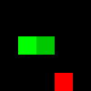
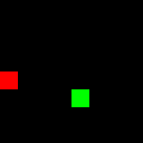
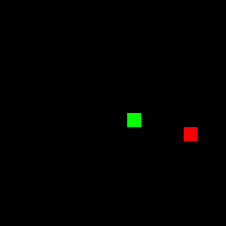
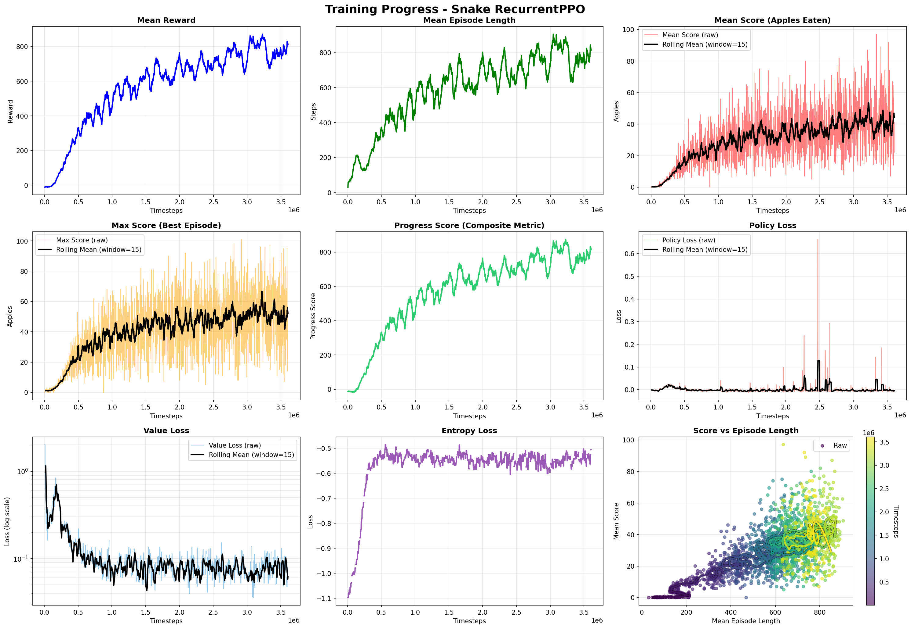

# Snake — RL agent for Snake (PPO)

Projekt: lekki agent PPO (Stable Baselines3) nauczony gry w Snake na siatkach o rozmiarach 5–16. Celem jest proste, czytelne środowisko Gym + Pygame używane do badań nad zachowaniami agenta i wizualizacją decyzji.

---

## Przykładowe przebiegi (GIFy) — szybki podgląd

| 5x5 | 8x8 | 16x16 |
|:---:|:---:|:----:|
|  |  |  |

---

## Szybkie uruchomienie (najpierw)

1. Aktywuj środowisko w katalogu głównym repo:
```powershell
.\venv\Scripts\Activate.ps1
```
2. Zainstaluj zależności:
```powershell
pip install -r requirements.txt
pip uninstal torch
pip install torch>=2.7 --index-url https://download.pytorch.org/whl/cu128
```
3. Trening (domyślnie):
```powershell
python .\snake\scripts\train.py
```
4. Test wytrenowanego modelu (okno Pygame):
```powershell
python .\snake\scripts\test_snake_model.py --grid_size 8 --episodes 2
```

## Generowanie GIF-ów (szybkie)

```powershell
python .\snake\scripts\make_gif.py --model_path .\snake\models\best_model.zip --grid_size 8 --episodes 1 --fps 8
```

Wynikowy GIF domyślnie: `snake/logs/snake_run.gif`.

---

## Szczegóły i pliki

Pliki i co robią:
- `model.py` — definicja środowiska Snake (Gym)
- `train.py` — trening agenta RL (z callbackami, VecNormalize itp.)
- `test_snake_model.py` — testowanie i debug (render_mode="human")
- `make_gif.py` — nagrywanie przebiegu agenta i składanie GIF-a (zapisuje klatki i tworzy `snake/logs/snake_run.gif`)
- `analyze_model.py` — analiza saliency i wykresów modelu (zapisuje wyniki w `snake/logs/analize_model/`)
- `plot_train_progress.py` — generowanie wykresu postępu treningu
- `config/config.yaml` — konfiguracja środowiska, modelu i ścieżek

Krótko o parametrach używanych w skryptach:
- `train.py`: większość hiperparametrów (np. `n_steps`, `n_envs`, `eval_freq`) jest w `config/config.yaml`. Domyślnie trening zapisuje modele do `snake/models/` i logi do `snake/logs/`.
- `test_snake_model.py`:
  - `--model_path` — ścieżka do modelu (domyślnie `snake/models/best_model.zip`)
  - `--grid_size` — rozmiar siatki (np. 8)
  - `--episodes` — liczba epizodów testowych
- `make_gif.py`:
  - `--model_path` — ścieżka do modelu (opcjonalne)
  - `--grid_size` — rozmiar siatki
  - `--episodes` — ile epizodów nagrać
  - `--fps` — liczba klatek na sekundę dla GIF-a
- `analyze_model.py` — uruchom bez parametrów, wyniki trafią do `snake/logs/analize_model/` (można modyfikować wewnątrz skryptu)

Uwaga o rozmiarach gridu:

Model trenowany był dla rozmiarów siatki w zakresie 5–16 (grid_size 5..16). Powyżej 16 mogą występować problemy z mechanizmem zoomowania (skalowaniem obserwacji do stałego rozmiaru 16x16), co może prowadzić do zniekształceń obrazu i gorszej jakości obserwacji. Jeśli chcesz trenować dla większych gridów, najlepiej dostosować wartość `FIXED_OBS_SIZE` w `model.py` lub zmodyfikować preprocessing obrazu.

---

## Trening i wyniki

Poniżej przykładowy wykres postępu treningu (średnia nagroda / epizod podczas treningu). Wykres generowany przez `plot_train_progress.py` i przeniesiony do `snake/docs/training_progress.png`.




# Wyjaśnienie metryk PPO (Stable Baselines3)

Podczas treningu w logach pojawiają się metryki, które pomagają monitorować postęp i stabilność uczenia:

- **approx_kl** — Przybliżona dywergencja KL. Pokazuje, jak bardzo zmieniła się polityka agenta po aktualizacji. Niska wartość = stabilne uczenie.
- **clip_fraction** — Ułamek aktualizacji, które zostały „ucięte” przez mechanizm PPO (clip_range). Wysoka wartość może oznaczać zbyt duże zmiany polityki.
- **clip_range** — Maksymalny zakres zmiany polityki w jednej aktualizacji (ustawienie PPO).
- **entropy_loss** — Entropia polityki. Im bliżej zera, tym bardziej deterministyczne decyzje agenta. Wyższa wartość = więcej eksploracji.
- **explained_variance** — Jak dobrze krytyk (value function) przewiduje nagrody. 0 = brak korelacji, 1 = idealne przewidywanie. Im wyżej, tym lepiej.
- **learning_rate** — Aktualna szybkość uczenia.
- **loss** — Całkowita strata modelu (łączna dla polityki i wartości). Ważny jest trend (czy maleje).
- **n_updates** — Liczba aktualizacji sieci.
- **policy_gradient_loss** — Strata gradientu polityki. Pokazuje, jak mocno aktualizowana jest polityka.
- **value_loss** — Strata funkcji wartości (krytyka). Im niższa, tym lepiej krytyk przewiduje nagrody.

Te wskaźniki pozwalają ocenić, czy agent uczy się stabilnie, nie „wariuje” i czy sieć wartości dobrze przewiduje nagrody.