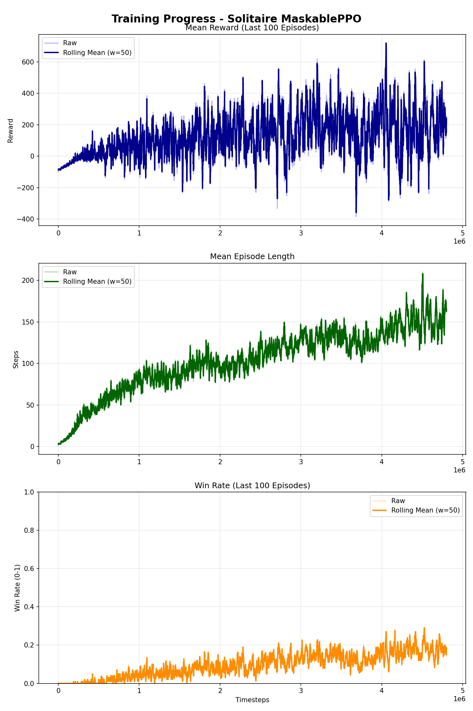

# Solitaire AI (Klondike)

Ten projekt zawiera środowisko Pasjansa (Klondike) oraz skrypty do trenowania agenta AI przy użyciu algorytmu **MaskablePPO** (Stable Baselines 3).

🚀 **Projekt został ulepszon na podstawie zaawansowanej architektury Snake AI** - zawiera attention mechanism, dropout regularization, mixed precision training i zaawansowane callbacki.

---

## Przykładowy przebieg (GIF) — szybki podgląd


---

## Struktura

- `config/config.yaml`: Konfiguracja środowiska i modelu.
- `scripts/model.py`: Implementacja środowiska Solitaire (Gymnasium).
- `scripts/cnn.py`: Ekstraktor cech (Feature Extractor) z attention mechanism.
- `scripts/train.py`: Skrypt treningowy z zaawansowanymi callbackami.
- `scripts/test_solitaire_model.py`: Wizualizacja rozgrywki agenta w oknie Pygame.
- `scripts/debug/make_gif.py`: Nagrywanie rozgrywki do pliku GIF.
- `scripts/utils/`: Utility functions (callbacks, plotting).
- `models/`: Katalog na zapisane modele.
- `logs/`: Logi treningowe i wykresy postępu.

---

## Uruchomienie treningu

Aby rozpocząć trening, uruchom skrypt `train.py` z katalogu głównego:

```bash
python ./solitaire/scripts/train.py
```

**Nowe funkcje treningu:**
- ✅ **32 równoległe środowiska** (SubprocVecEnv)
- ✅ **AdamW optimizer** z weight decay
- ✅ **Entropy scheduler** - automatyczne zmniejszanie entropii
- ✅ **Win tracker** - śledzenie współczynnika wygranych
- ✅ **Auto-stop** przy braku postępów
- ✅ **Auto-plotting** po każdej ewaluacji

---

## Testowanie modelu

### Wizualizacja w oknie Pygame
Aby zobaczyć grę agenta w czasie rzeczywistym:

```bash
python ./solitaire/scripts/test_solitaire_model.py
```

Funkcjonalności:
- Interaktywny wybór modelu (best_model.zip lub solitaire_ppo_model.zip)
- Graficzna wizualizacja stanu gry
- Wyświetlanie podjętych akcji, nagród i wyników
- Komunikaty o przegranej/wygranej/poddaniu się

### Nagrywanie do GIF-a
Aby nagrać rozgrywkę w formacie GIF:

```bash
python ./solitaire/scripts/debug/make_gif.py --episodes 1 --fps 2
```

Parametry:
- `--episodes`: Liczba epizodów do nagrania (default: 1)
- `--fps`: Klatki na sekundę (default: 2)
- `--pause`: Czas pauzy na ostatniej klatce w sekundach (default: 3.0)
- `--out`: Niestandardowa ścieżka wyjściowa GIF-a

Wynik zapisywany jest do `solitaire/logs/solitaire_run.gif`.

## Zasady (Uproszczone)

- **Draw Stock**: Dobieranie karty z talii.
- **Ruchy**:
  - Z talii (Waste) na stół (Tableau).
  - Z talii (Waste) na stosy bazowe (Foundations).
  - Między kolumnami na stole (Tableau -> Tableau).
  - Ze stołu na stosy bazowe (Tableau -> Foundations).
  - Z talii (Stock) na stosy bazowe (Stock -> Foundations).
  - Poddanie się (Surrender) - agent może zakończyć grę, gdy uzna ją za beznadziejną.
- **Cel**: Umieścić wszystkie karty na stosach bazowych (Foundations).

## Architektura Sieci Neuronowej 🧠

### Feature Extractor (cnn.py) - Ulepszona Architektura

Sieć wykorzystuje zaawansowaną architekturę z komponentami zainspirowanymi Snake AI:

#### Komponenty sieci:

1. **Tableau Network** (7×20×4 → 256 cech)
   - Głęboka sieć: [384, 256] z dropout (0.02)
   - LayerNorm + GELU activation
   - **Attention mechanism** - fokus na ważnych kartach
   
2. **Foundations Network** (4 → 64 cechy)
   - Pojedyncza warstwa z LayerNorm
   - Brak dropout (małe wejście)

3. **Waste Network** (3 → 64 cechy)
   - Pojedyncza warstwa z LayerNorm
   - Brak dropout (małe wejście)

4. **Stock Network** (52×3 → 96 cech)
   - Głęboka sieć: [128, 96] z dropout (0.02)
   - LayerNorm + GELU activation
   - **Attention mechanism** - fokus na dostępnych kartach

5. **Fusion Network** (480 → 512 cech)
   - Łączy wszystkie komponenty
   - LayerNorm + GELU + Dropout (0.04)

#### Zaawansowane funkcje:

- ✅ **Attention Mechanism** - automatyczne skupienie na ważnych elementach stanu
- ✅ **BF16 Mixed Precision** - szybszy trening na GPU (~30% przyspieszenie)
- ✅ **LayerNorm** - stabilizacja treningu
- ✅ **GELU Activation** - lepsza od ReLU w deep learning
- ✅ **Dropout Regularization** - zapobiega overfittingowi
- ✅ **He Initialization** - poprawna inicjalizacja wag

#### Policy & Value Networks:

- **Policy (Actor)**: [512, 256, 128] → 87 akcji
- **Value (Critic)**: [512, 512, 256] → 1 wartość stanu

**Całkowita liczba parametrów**: ~800K-1.2M (zależnie od konfiguracji)

---

## Postęp Treningu 📊

Poniższe wykresy pokazują postęp treningu modelu (8 metryk w układzie 4×2):

### Training Progress


**Nowe metryki (dodane w ulepszeniu):**

1. **Mean Reward** - Średnia nagroda (wygładzona)
   - Ewolucja średniej nagrody na ostatnie 100 epizodów
   - Agent systematycznie uczy się grać lepiej

2. **Win Rate** - Współczynnik wygranych
   - Zaczyna od ~0% i rośnie do ~15-20%
   - Pasjans Klondike jest bardzo trudny (nawet człowiek wygrywa w ~15-20%)
   - Agent osiąga wyniki porównywalne z człowiekiem

3. **Mean Score** - Średni wynik w grze
   - Suma nagród z poszczególnych akcji
   - Wyższy score = lepsza strategia

4. **Max Score** - Maksymalny wynik osiągnięty
   - Tracking najlepszych gier
   - Pokazuje potencjał agenta

5. **Mean Foundations Filled** - Średnia liczba kart na fundacjach
   - 0-52 karty (cel: 52)
   - Im wyżej, tym bliżej wygranej

6. **Mean Episode Length** - Średnia długość epizodu
   - Dłuższe epizody = agent nie poddaje się szybko
   - Wzrost z ~10 do ~100-150 kroków pokazuje lepszą strategię

7. **Mean Moves per Game** - Średnia liczba ruchów
   - Efektywność gry
   - Mniej ruchów = lepsza strategia

8. **Combined Performance** - Znormalizowane metryki
   - Win Rate, Score, Foundations na jednym wykresie
   - Łatwe porównanie postępów

**Monitoring w czasie rzeczywistym:**
- CSV: `logs/train_progress.csv` (11 kolumn)
- TensorBoard: `logs/ppo_X/`
- Wykresy: Auto-update po każdej ewaluacji

---

## Konfiguracja ⚙️

Wszystkie parametry są zdefiniowane w `config.yaml`:

### Nagrody (Reward Scaling)
- `move_to_foundation`: +20 (główny cel - karta na fundację)
- `flip_tableau_card`: +7 (odkrywanie kart)
- `move_waste_to_tableau`: +2 (przygotowanie)
- `move_tableau_to_tableau`: -0.5 (zniechęcanie do zbyt wielu przesunięć)
- `win_bonus`: +2000 (wygrana gry!)
- `invalid_move_penalty`: -0.5 (kara za niewalidny ruch)
- `time_penalty`: -0.1 (kara za każdy krok)
- `recycle_waste_penalty`: -10 (kara za przetasowanie talii)
- `surrender_penalty`: -100 (kara za poddanie się)

### Parametry Modelu (MaskablePPO)
- `learning_rate`: 0.0003 (początkowy)
- `min_learning_rate`: 0.00001
- `n_steps`: 4096 (kroki na aktualizację)
- `batch_size`: 4096
- `n_epochs`: 8
- `gamma`: 0.995 (dyskont przyszłych nagród)
- `gae_lambda`: 0.97
- `clip_range`: 0.2
- `ent_coef`: 0.03 → 0.005 (scheduler)
- `vf_coef`: 0.5

### Optimizer (AdamW)
- `type`: adamw
- `weight_decay`: 0.0001 (regularizacja L2)
- `eps`: 1e-8
- `betas`: [0.9, 0.999]

### Dropout (Regularization)
- `tableau_dropout`: 0.02
- `stock_dropout`: 0.02
- `fusion_dropout`: 0.04
- `foundations_dropout`: 0.0 (małe wejście)
- `waste_dropout`: 0.0 (małe wejście)

### Parametry Treningu
- `n_envs`: 32 (równoległe środowiska)
- `total_timesteps`: 20,000,000
- `eval_freq`: 16,384
- `eval_n_envs`: 4
- `eval_n_repeats`: 3
- `max_no_improvement_evals`: 50 (auto-stop)
- `min_evals`: 20

---

## Przykład Rozgrywki 🎮

GIF pokazany na początku dokumentacji zawiera przykładową rozgrywkę agenta w akcji:
- Agent wybiera ruchy w oparciu o wytrenowany model neuronowy
- **Attention mechanism** pomaga skupić się na najważniejszych kartach
- Karty z talii są stopniowo odkrywane
- Karty są przenoszone na stosy bazowe (Foundations) gdy jest to możliwe
- Agent wykorzystuje strategię, aby maksymalizować szanse na zwycięstwo

---

## Normalizacja Danych

Wszystkie dane wejściowe są znormalizowane do zakresu [0.0, 1.0]:
- Ranga karty: `rank / 13.0`
- Kolor karty: `suit / 3.0`
- Obecność karty: `0.0` lub `1.0`
- Face up/down: `0.0` lub `1.0`

To znacznie poprawia stabilność treningu sieci neuronowej.

---

## Wymagania

```
stable-baselines3
sb3-contrib
torch
gymnasium
pygame
matplotlib
numpy
pyyaml
```

---

## Licencja

MIT License - projekt edukacyjny

---

**Powodzenia w treningu! 🎲🃏**
